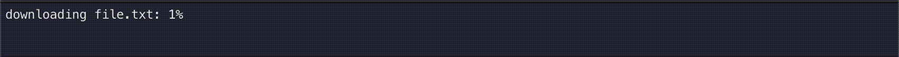
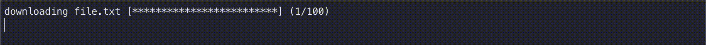

# go-dout

`go-dout` provides the ability to dynamically output information to the console. The packge works on macos and linux.

When using the `go-dout` package, you should not use other ways to output information to the console. This can lead to erratic behavior.

## Install package

```
    go get github.com/gen95mis/go-dout
```

# Using

An example of usage can be found [here](https://github.com/gen95mis/go-dout/blob/main/example/example.go)

## Typical using Line


```
	v := dout.GetView()
	line := v.NewLine()
	for i := 0; i <= 100; i++ {
		line.Set("number of iterations: %d", i)
	}
```




## Typical using ProgressBar

```
	v := dout.GetView()
	pb := v.NewProgressBar()
	for i := 0; i <= 100; i++ {
		pb1.Set("downloading file.txt", i, 100)
	}
```



## Add Title

Adds input data before other data

```
v := dout.GetView()
v.NewTitle("some title")
```

## Print

Print data to console. Similar to fmt.Printf

```
v := dout.GetView()
v.Print("Exit\n")
```

Bad practice!!! Print() preferred v.NewLine().Set()

```
// bad practice
v := dout.GetView()
v.NewLine().Set("Completed!")
```
